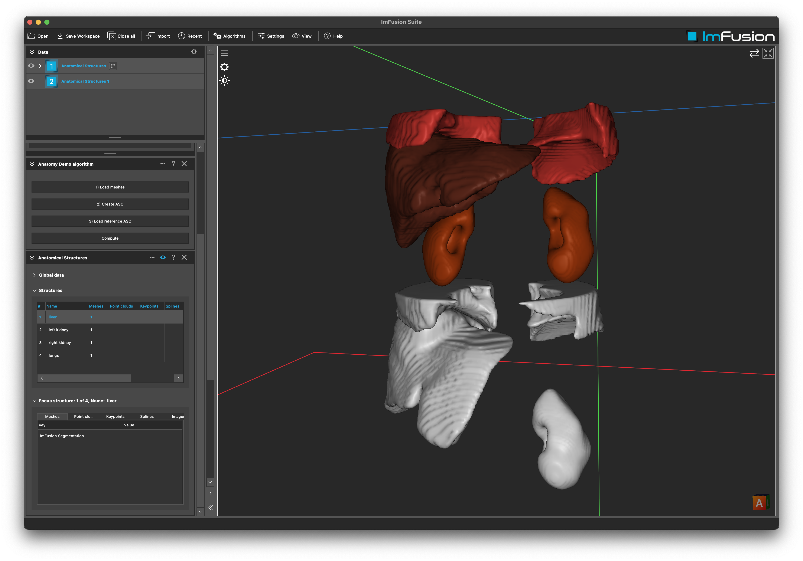

# Example Anatomy Plugin

## Summary
This tutorial explains how you can use the AnatomyPlugin to represent `AnatomicalStructures` (AS) and combine them in a `AnatomicalStructureCollection` (ASC). For this we implement a custom plugin with a single algorithm. This algorithm loads several meshes and combines them into a ASC.

**Note:** This demo plugin is build upon the ExamplePlugin. Please refer to the README.md there for more details on setting up an ImFusionPlugin.

## Implementation details

- Instead of implementing a custom controller like done in the ExamplePlugin, here we utilize the `DefaultAlgorithmController` which will automatically create a UI based on the `Configurable` interface of the `Algorithm`.
- We showcase `Algorithm::registerAction()` which enables the SDK developer to add custom actions to an Algorithm. These will automatically show up in the `DefaultAlgorithmController` and will create python bindings if such are created for the plugin.
- As keys for the ASs we use our ImFusion::Keys. You can also have a look at the TotalSegmentatorAnatomyPlugin for an example on how to customize keys in your application.
- In this example the `compute()` method is left empty as the main functionality was handled in the actions. A common usecase would be to run an `ASCRegistration` in `compute()` to align the patient specific ASC to e.g. a template.