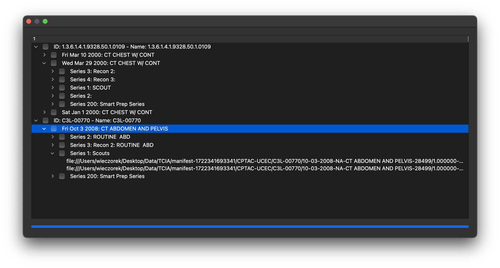

# Example DICOM Browser

## Summary
This tutorial will explain how to build a simple DICOM browser using the ImFusionDicom plugin.

**Note:** The setup for this example is very similar to the ExampleStandaloneApplication. Thus we omit any redundant information here and refer to the ExampleStandaloneApplication for more information.

## Implementation details

- In contrast to the ExmampleStandalineApplication, this application is not build upon the `ApplicationController`. Instead the ImFusion framework in initialized via `ImFusion::Framework::init()`.
- The DicomBrowser consists of a `QTreeView`, which displays the DicomBrowserModel, and a `QProgressBar`, which indicates the status of the asychronous scanning of the DICOM files.

## Dataset

For the screenshot we used data from The Cancer Imaging Archive:

National Cancer Institute Clinical Proteomic Tumor Analysis Consortium (CPTAC). (2019).  The Clinical Proteomic Tumor Analysis Consortium Uterine Corpus Endometrial Carcinoma Collection (CPTAC-UCEC) (Version 12) [Data set]. The Cancer Imaging Archive. https://doi.org/10.7937/K9/TCIA.2018.3R3JUISW