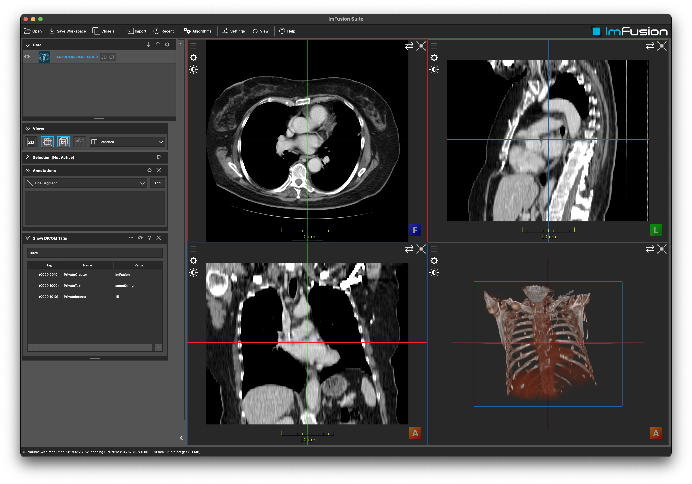

# Dicom Extension Example

## Summary
This tutorial will explain how to implement a `DicomExtention` to read and write custom DICOM tags.
Furthermore you will learn how you can attach the information read from the tags to the corresponding dataset using a `DataComponent`.

**Note:** This demo plugin is build upon the ExamplePlugin. Please refer to the README.md there for more details on setting up an ImFusionPlugin.

## Implementation details

- The `Dicom::Extension` is implemented in `DemoExtension`. The extension reads and writes three dicom tags. First the creator tag of the private tags and then two private tags, one string and one int.
- The type of private tags need to be registered with dcmtk. This happen in the constructor of `DemoExtension`.
- In order to store the information read from the tags and attach it to the corresponding image we implement the `DemoDataComponent`.
- Both, the `DemoExtension` and the `DemoDataComponent` are registered with the framework in the `DemoPlugin` constructor.

## Dataset

For the screenshot we used data from The Cancer Imaging Archive:

National Cancer Institute Clinical Proteomic Tumor Analysis Consortium (CPTAC). (2019).  The Clinical Proteomic Tumor Analysis Consortium Uterine Corpus Endometrial Carcinoma Collection (CPTAC-UCEC) (Version 12) [Data set]. The Cancer Imaging Archive. https://doi.org/10.7937/K9/TCIA.2018.3R3JUISW