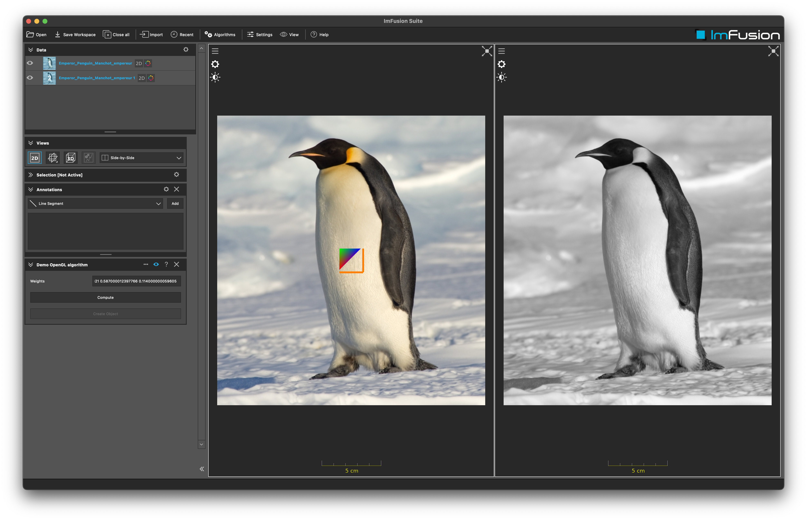

# Example OpenGL

## Summary
In this tutorial you will learn about two different ways to use OpenGL using our SDK.
First, similar to the ExampleImageMath, we will show you how to implement a shader to convert a color image to gray.
Second, we will show how you can implement your own `GlObject` which can be displayed in our views. 

**Note:** This demo plugin is build upon the ExamplePlugin. Please refer to the README.md there for more details on setting up an ImFusionPlugin.

## Implementation details

- For the conversion to gray we use a simple fragment shader in combination with the `ImageProgram`. This is a specialization of the `Program` and tailored to the use case of rendering into images.
- This shader needs to be registered with our `Resource` system. This happens in the constructor of the plugin.
- The logic for a custom `GlObject` is implemented in `MyCustomGlObject`. How to add the object to the view is shown in the `DemoApplicationController`.
