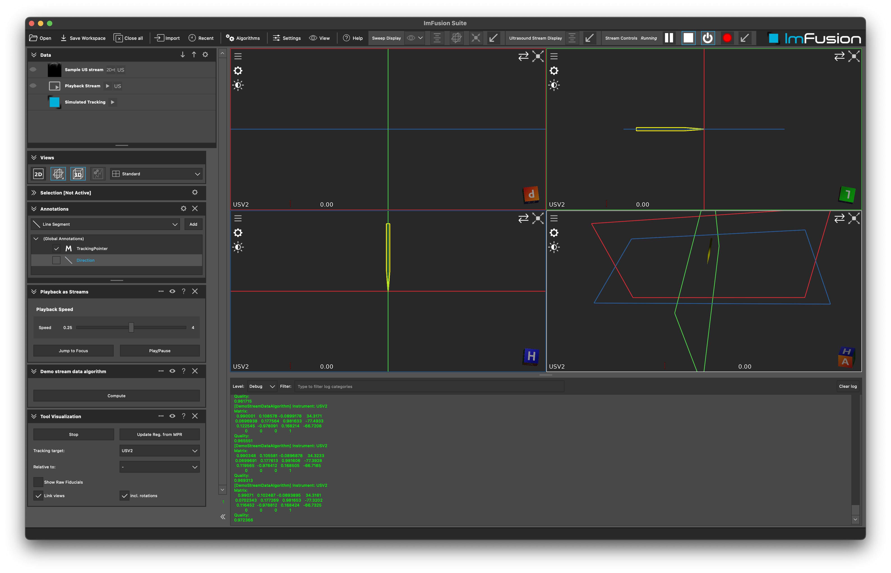

# Example StreamData

## Summary
Within this tutorial you will learn how to use a `LiveTrackingStream`, e.g. coming for our NDIPlugin or any other source of tracking data, and use it in you `Algorithm`.
In this simple example we will simply print the tracking data to the console.

**Note:** This demo plugin is build upon the ExamplePlugin. Please refer to the README.md there for more details on setting up an ImFusionPlugin.

## Implementation details

In the constructor of the `DemoStreamDataAlgorithm` we register to the `signalNewData` of the `LiveTrackingStream`. This signal is emitted whenever new tracking data is available.
We print all instruments available in the stream and print the current matrix, the name, and the quality.
